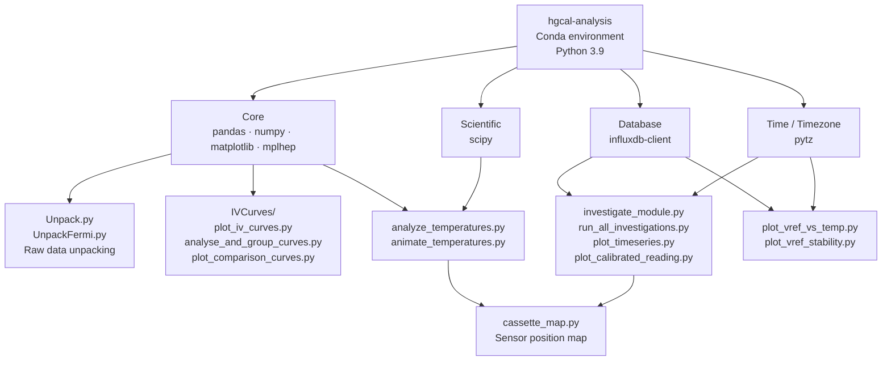

# HGCAL Data Analysis Pipeline

Tools for unpacking raw HGCAL data, generating IV curves, and monitoring cassette temperatures and voltages via InfluxDB.

---

## Environment



---

## Setup

### Prerequisites

A Conda-based package manager: **Miniconda**, **Anaconda**, or **Micromamba**.

### Create the environment

```bash
# Conda / Anaconda
conda env create -f environment.yml

# Micromamba
micromamba create -f environment.yml
```

### Activate the environment

```bash
conda activate hgcal-analysis
# or
micromamba activate hgcal-analysis
```

Your prompt should show `(hgcal-analysis)`.

---

## Scripts

### Raw Data Unpacking

**`Unpack.py`** / **`UnpackFermi.py`**

Processes raw HGCAL `.txt` data files, decodes binary packets, and generates ADC, ADC-1, and noise plots.

```
your-project-directory/
├── Unpack.py
└── data/
    ├── data_file_1.txt
    └── ...
```

```bash
python Unpack.py data

# Specify a different marker link (default: link6)
python Unpack.py data --marker_link link0
```

Output:
- `Unpacked_data/` — decoded data as `.pkl` files
- `Plots/` — output plots as `.pdf`

---

### IV Curves

**`IVCurves/plot_iv_curves.py`**

Generates individual per-channel IV plots and a combined overlay for all channels.

```bash
# Run on a specific data directory
python IVCurves/plot_iv_curves.py \
  --data-dir ./iv_curve_data_2026-04-23_170750 \
  --output-dir ./iv_plots_cold_2026-04-23

# Without arguments: picks the latest iv_curve_data_* folder in the current directory
python IVCurves/plot_iv_curves.py
```

**`IVCurves/analyse_and_group_curves.py`**

Groups channels by leakage and breakdown behaviour (thresholds: 10 µA leaky, 100 µA breakdown).

```bash
python IVCurves/analyse_and_group_curves.py
```

**`IVCurves/plot_comparison_curves.py`**

Individual per-channel plots with reference sensor IDs annotated in the title.

```bash
python IVCurves/plot_comparison_curves.py
```

---

### Temperature Monitoring

**`analyze_temperatures.py`**

Retrieves RTD sensor data from InfluxDB, interpolates across the cassette, and produces heatmaps. Requires `cassette_map.py` in the same directory.

```bash
python analyze_temperatures.py
```

**`animate_temperatures.py`**

Generates an animated `.mp4` of cassette temperature distribution over time.

```bash
python animate_temperatures.py
```

---

### InfluxDB Module Investigation

Requires an InfluxDB instance running locally (LABC2 on port 8086, LABC3 on port 8087) and the token set as an environment variable:

```bash
export INFLUXDB_TOKEN=your_token_here
```

**`investigate_module.py`**

Queries HV, current, and temperature for a single module.

```bash
python investigate_module.py
```

**`run_all_investigations.py`**

Batch-runs `investigate_module.py` across all cassette modules.

```bash
python run_all_investigations.py
```

**`plot_timeseries.py`**

Time-series plots for all trains over a configurable time window.

```bash
python plot_timeseries.py
```

**`plot_calibrated_reading.py`**

Plots calibrated sensor readings from InfluxDB.

```bash
python plot_calibrated_reading.py
```

---

### VREF Calibration (lpGBT)

**`plot_vref_vs_temp.py`**

Plots `VREF_TUNE` calibration values vs internal junction temperature (`tj_user`) across both databases.

```bash
python plot_vref_vs_temp.py
```

**`plot_vref_stability.py`**

Temperature stability analysis for lpGBT VREF across a run.

```bash
python plot_vref_stability.py
```
